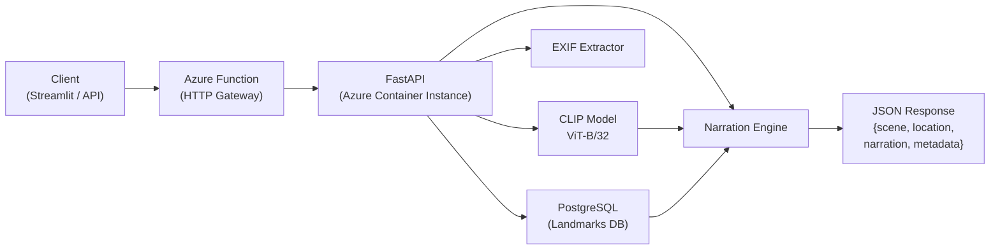

# Spatial Context Agent

A location-aware AI backend for spatial tour guide experiences.


---

## Architecture



---

## The Problem

AR tour guides and spatial storytelling platforms need an AI brain that can answer: *"What am I looking at, and where am I?"* A tourist points their phone at the Brandenburg Gate — the system must classify the scene, match it to a known landmark, and narrate historical context in real time, without requiring the user to search or type anything.

This project is that brain: a production-grade REST API that combines zero-shot computer vision (CLIP) with geospatial context retrieval (Haversine + PostgreSQL) to generate contextual tour guide narrations from a single photo.

---

## Tech Stack

| Component | Technology |
|---|---|
| Language | Python 3.11 |
| Vision model | OpenAI CLIP (ViT-B/32) via PyTorch |
| API framework | FastAPI + Uvicorn |
| Database | PostgreSQL 16 (SQLAlchemy ORM) |
| Containerisation | Docker (multi-stage build) |
| Local dev | docker-compose |
| Cloud | Azure (Container Instances, Functions, Container Registry, PostgreSQL Flexible Server) |
| IaC | Terraform (Azure provider) |
| CI/CD | GitHub Actions (test → build → deploy) |
| Demo UI | Streamlit |
| Testing | pytest + httpx TestClient |
| Linting | Ruff |

---

## Quick Start

```bash
# 1. Clone and enter the project
git clone https://github.com/Rithub14/spatial-context-agent.git
cd spatial-context-agent

# 2. Start the API + database, then seed Berlin landmarks
docker-compose up --build -d
docker-compose exec api python -m src.db.seed

# 3. Test the API
curl -X POST http://localhost:8000/api/v1/analyze \
  -H "Content-Type: application/json" \
  -d '{
    "image": "'$(base64 -i your_photo.jpg)'",
    "latitude": 52.5163,
    "longitude": 13.3777
  }'

# 4. Launch the Streamlit demo UI
pip install -r requirements-streamlit.txt
streamlit run streamlit_app/app.py
```

---

## API Documentation

### `POST /api/v1/analyze`

Classify a scene, find the nearest landmark, and generate a tour guide narration.

**Request**
```json
{
  "image": "<base64-encoded JPEG or PNG>",
  "latitude": 52.5163,
  "longitude": 13.3777,
  "max_narration_length": 200
}
```
`latitude` / `longitude` are optional if the image contains GPS EXIF metadata.

**Response**
```json
{
  "scene": {
    "primary": "monument",
    "confidence": 0.74,
    "alternatives": [{"category": "historic building", "confidence": 0.12}]
  },
  "location": {
    "nearest_landmark": "Brandenburg Gate",
    "distance_meters": 42.3,
    "district": "Mitte",
    "city": "Berlin"
  },
  "narration": "I can see you're looking at a monument. You're standing before the iconic Brandenburg Gate...",
  "metadata": {
    "model_version": "ViT-B/32",
    "inference_time_ms": 312,
    "timestamp": "2024-01-15T10:30:00Z",
    "coordinates": {"latitude": 52.5163, "longitude": 13.3777}
  }
}
```

### `GET /health`

```json
{
  "status": "ok",
  "model_loaded": true,
  "db_connected": true,
  "uptime_seconds": 142.7
}
```

### `GET /api/v1/locations?limit=20&offset=0`

Paginated list of all landmarks in the database.

### `POST /api/v1/locations`

Add a new landmark (requires `X-API-Key` header when `ENABLE_AUTH=true`).

---

## Project Structure

```
spatial-context-agent/
├── src/
│   ├── api/
│   │   ├── main.py                 # FastAPI app, lifespan, middleware wiring
│   │   ├── routes/
│   │   │   ├── agent.py            # POST /api/v1/analyze, GET+POST /locations
│   │   │   └── health.py           # GET /health
│   │   ├── middleware/
│   │   │   ├── auth.py             # API key validation (toggleable)
│   │   │   └── rate_limiter.py     # Per-IP sliding window (toggleable)
│   │   └── schemas/
│   │       ├── request.py          # AnalyzeRequest, LandmarkCreateRequest
│   │       └── response.py         # AnalyzeResponse, HealthResponse, etc.
│   ├── pipeline/
│   │   ├── clip_inference.py       # CLIP model loading + inference
│   │   ├── scene_classifier.py     # Zero-shot classification (12 categories)
│   │   ├── location_extractor.py   # EXIF GPS extraction
│   │   ├── context_retriever.py    # Haversine nearest-landmark lookup
│   │   └── narration_engine.py     # Template-based tour guide narration
│   ├── db/
│   │   ├── models.py               # SQLAlchemy ORM (landmarks, inference_logs)
│   │   ├── seed.py                 # 18 real Berlin landmarks
│   │   └── session.py              # Engine, SessionLocal, get_db dependency
│   └── config.py                   # pydantic-settings (all config from env)
├── tests/                          # 62 tests, all passing
├── terraform/                      # Azure IaC (ACR, PostgreSQL, ACI, Function)
├── azure_function/                 # HTTP gateway (Python v2 model)
├── streamlit_app/                  # Demo dashboard
├── scripts/
│   └── smoke_test.py               # Post-deploy smoke test (CI-safe)
├── Dockerfile                      # Multi-stage production build
└── docker-compose.yml              # Local dev (FastAPI + PostgreSQL)
```

---

## Design Decisions

**Why CLIP for scene classification?**
Zero-shot — no labelled training data or model retraining needed per city. Adding new landmark categories means updating a Python list, not retraining. Uses ViT-B/32 which balances accuracy and CPU inference speed (~300 ms per image).

**Why template-based narration?**
No LLM dependency in the critical path means zero latency variance, no API costs, and 100% offline capability. DB templates are authored by humans so quality is consistent. LLM-powered narration (LangChain + GPT-4) is a documented next step.

**Why EXIF GPS extraction?**
Tourists already have GPS metadata in every smartphone photo. Auto-extracting it removes friction — no manual coordinate entry needed. Explicit lat/lng is the fallback for images without EXIF.

**Why toggleable auth + rate limiting?**
Demonstrates security awareness without making local development painful. `ENABLE_AUTH=false` + `ENABLE_RATE_LIMIT=false` for dev/test, flip to `true` in production via env vars — no code changes.

**Why Azure?**
Closest region to Berlin is `westeurope`. Container Instances for the stateful API (model loaded in memory), Functions for the serverless gateway (scales to zero), PostgreSQL Flexible Server for the landmark DB.

---

## Infrastructure

All Azure resources are defined in `terraform/` and provisioned with:

```bash
cd terraform
terraform init
terraform apply \
  -var="container_image=<acr>.azurecr.io/spatial-agent:latest" \
  -var="db_admin_password=<secret>"
```

Resources created: Resource Group → ACR (Basic) → PostgreSQL Flexible Server (B1ms) → Container Instance (1 vCPU / 1.5 GB) → Storage Account → Function App (consumption Y1).

The CI/CD pipeline (`ci-cd.yml`) handles automated deployments on every merge to `main`. See the required secrets documented at the top of `.github/workflows/ci-cd.yml`.

---

## Testing

```bash
# Run all 62 tests
PYTHONPATH=. pytest tests/ -v

# With coverage report
PYTHONPATH=. pytest --cov=src --cov-report=term-missing tests/

# Smoke test against a running instance
python scripts/smoke_test.py --url http://localhost:8000
```

Test coverage targets >80%. CLIP model is always mocked in tests (slow to load). SQLite in-memory with `StaticPool` is used as the test database.

---

## What I'd Improve With More Time

- **Fine-tuned CLIP** on a landmark-specific dataset for higher classification accuracy on architectural features
- **LLM-powered narration** via LangChain + GPT-4 for richer, dynamic, multi-language responses
- **Edge model distillation** — compress CLIP to run on-device for offline AR inference
- **Monitoring** with Prometheus metrics + Grafana dashboard (inference latency, landmark hit rate)
- **Multi-language support** — narration templates in DE/FR/ES, language detection from `Accept-Language` header
- **User feedback loop** — thumbs up/down on narrations feeds back to improve template quality
- **Model A/B testing** framework to compare CLIP variants (ViT-B/16, ViT-L/14) on real traffic

---

## License

MIT
